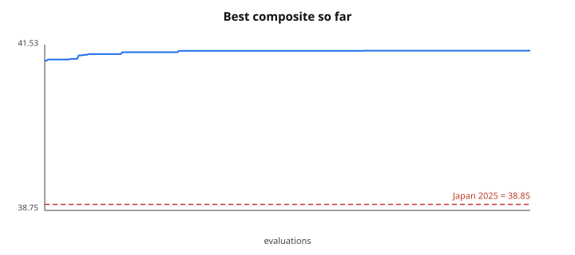
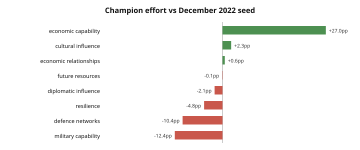

# Archive analysis

> **SURROGATE ARCHIVE — NOT A RESULT.** Scored by the closed-form stand-in in `tasks/japan_fp/judge/surrogate.py`, with programmatic mutation rather than an LLM. This validates the pipeline, not the policy. Never report these numbers.

- Evaluated **301**, valid 281, rejected by the gate 20 (7%)
- Seed **41.2549** → best **41.4268** (+0.1719)
- Japan 2025 baseline 38.8475; champion is +2.5793 against it
- Champion lineage depth **15** — cumulative improvement, not a single lucky jump

## RQ1 — does the search beat the seed?

## Where the champion moved effort

| Measure | 2025 score | headroom | seed | champion | shift |
|---|---|---|---|---|---|
| economic capability | 25.4 | 74.6 | 13.0% | 40.0% | +27.0pp |
| cultural influence | 48.5 | 51.5 | 4.0% | 6.2% | +2.2pp |
| economic relationships | 36.9 | 63.1 | 13.0% | 13.6% | +0.6pp |
| future resources | 11.3 | 88.7 | 6.0% | 5.9% | -0.1pp |
| diplomatic influence | 85.4 | 14.6 | 6.0% | 3.9% | -2.1pp |
| resilience | 34.3 | 65.7 | 14.0% | 9.2% | -4.8pp |
| defence networks | 56.5 | 43.5 | 15.0% | 4.6% | -10.4pp |
| military capability | 30.1 | 69.9 | 29.0% | 16.6% | -12.4pp |

## Operator effectiveness

`improved` counts children that scored above their own parent — the only fair measure of an operator, since parents differ in quality.

| Operator | tried | valid | improved | improve rate |
|---|---|---|---|---|
| `break_invariant` | 11 | 0 | 0 | 0% |
| `concentrate` | 46 | 46 | 12 | 26% |
| `defence_path` | 36 | 27 | 0 | 0% |
| `initiative:add` | 27 | 27 | 0 | 0% |
| `initiative:drop` | 9 | 9 | 0 | 0% |
| `phases` | 28 | 28 | 0 | 0% |
| `reallocate` | 143 | 143 | 48 | 34% |
